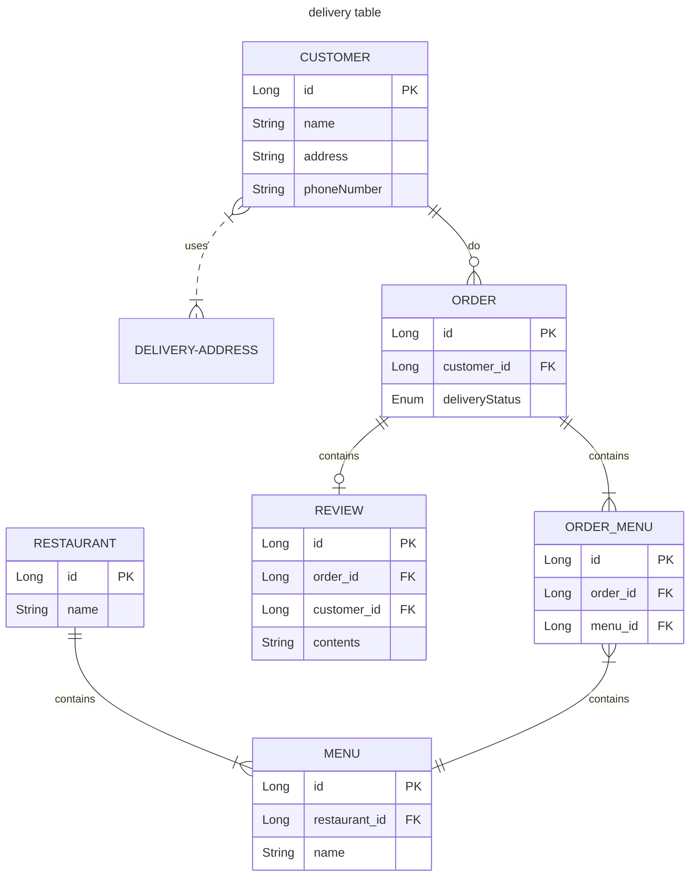

# Delivery sample application

## Overview

JPA 학습 및 Kotlin 에 익숙해지기 위한 샘플 애플리케이션

## ERD

- Review
- Customer
- Shop
- **Order**
- Menu

## Request

### Customer

- 회원가입이 가능하다.
    - 회원가입시에는 이름을 입력해야 한다.
    - 회원가입시에는 주소를 입력해야 한다.
    - 회원가입시에는 전화번호를 입력해야 한다.

### Order

- 사용자는 주문을 생성할 수 있다.
    - 주문을 생성한 사용자는 **주문당 하나의 리뷰를 작성**할 수 있다.
    - 사용자는 **한 번에 하나의 식당에만 주문**할 수 있다.
- 한 번의 주문에 여러 메뉴를 담을 수 있다.
- (Optional) 배달이 완료되기 전에는 다른 주문을 할 수 없다.

### Restaurant & Menu

식당과 메뉴는 이미 등록되어 있다.

### (Optional) Security

#### Owner

- 회원가입이 가능하다.
    - 회원가입시에는 이름을 입력해야 한다.
    - 회원가입시에는 가게명(상호)를 입력해야 한다.
    - 회원가입시에는 전화번호를 입력해야 한다.

#### Restaurant

- Owner 만 식당을 등록할 수 있다.

#### Menu

- 식당을 등록한 Owner 만 Menu 를 등록할 수 있다.
